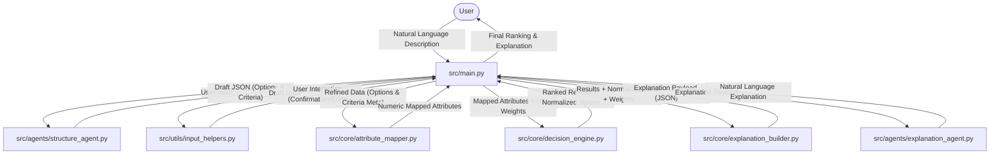

# Data Flow Diagram

The following diagram illustrates the flow of data through the Decision-Lens system, from initial user input to the final generated explanation.

## Flow Description

1.  **Input & Structuring**: The user provides a natural language description of their decision problem. The `structure_agent` (using GPT-4o-mini) extracts a draft structure consisting of options and criteria.
2.  **Refinement**: `input_helpers` facilitate a series of user confirmation steps (confirming options, criteria, cost/benefit types, and ordinal scales).
3.  **Mapping**: The `attribute_mapper` converts qualitative descriptors (e.g., "high", "good") and numeric strings into a standardized numeric format based on the defined scales and units.
4.  **Scoring**: The `decision_engine` applies a weighted sum model to the mapped attributes. It handles missing values through weight renormalization and normalizes scores across options.
5.  **Payload Building**: The `explanation_builder` constructs a deterministic JSON payload that identifies top positive/negative factors and missing data for each option.
6.  **Explanation**: The `explanation_agent` transforms the factual payload into a human-readable, natural language explanation for the user.

